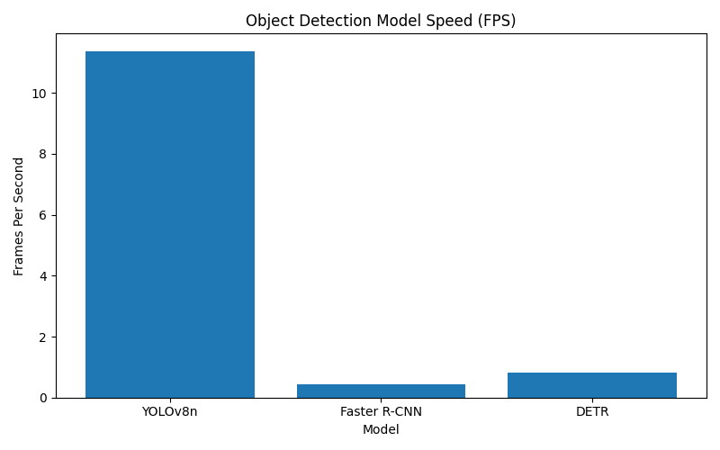
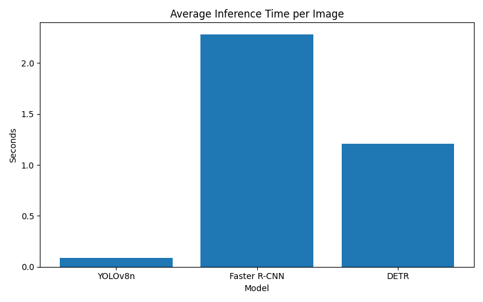

# Object Detection Benchmark (COGS 181 Final Project)

## Overview

This project benchmarks three different object detection architectures on the Pascal VOC dataset. The goal is to compare how different detection approaches perform in terms of inference speed when processing the same images.

The models evaluated are:

- YOLOv8 (single-stage CNN detector)
- Faster R-CNN (two-stage CNN detector)
- DETR (transformer-based detector)

Each model was run on the same subset of images to ensure a fair comparison.

---

## Dataset

This project uses the **Pascal VOC 2007 dataset**.

For benchmarking purposes, **100 images from the VOC2007 test set** were used.

Dataset structure used in the project:

```
datasets/
    images/
        test2007/
        train2007/
        val2007/
```

---

## Models Compared

### YOLOv8
YOLOv8 is a single-stage object detector developed by Ultralytics. It performs object detection in one pass through the network, making it extremely fast and suitable for real-time applications.

Key characteristics:
- Single-stage detection
- Real-time capable
- Optimized inference speed

### Faster R-CNN
Faster R-CNN is a two-stage object detection architecture. It first generates region proposals and then classifies each proposed region.

Key characteristics:
- Region Proposal Network (RPN)
- Two-stage detection pipeline
- Higher computational cost than single-stage detectors

### DETR
DETR (Detection Transformer) is a transformer-based object detection model that removes many traditional detection components such as anchor boxes and non-maximum suppression.

Key characteristics:
- Transformer-based architecture
- End-to-end detection pipeline
- Simplified detection framework

---

## Experimental Setup

Images evaluated: **300**

Hardware used:
- Laptop CPU
- Python environment with PyTorch

All models used **pretrained weights** and were evaluated on the same image set.

The following metrics were recorded:

- Total runtime
- Average inference time per image
- Frames per second (FPS)

---

## Results

| Model | Architecture | Avg Time/Image | FPS |
|------|--------------|---------------|------|
| YOLOv8n | Single-stage CNN | 0.080 s | 12.49 |
| Faster R-CNN | Two-stage CNN | 2.214 s | 0.45 |
| DETR | Transformer | 1.181 s | 0.85 |

---

## Speed Comparison

### FPS Comparison



### Average Inference Time



### Total Runtime


---

## Sample Predictions

Example detections generated by each model.

YOLO predictions:

```
results/sample_predictions/yolo/
```

Faster R-CNN predictions:

```
results/sample_predictions/frcnn/
```

DETR predictions:

```
results/sample_predictions/detr/
```

---

## Key Findings

YOLOv8 achieved the fastest inference speed by a large margin. Its single-stage architecture allows it to process images quickly and makes it suitable for real-time applications.

Faster R-CNN was the slowest model tested. The two-stage pipeline introduces additional computation because the model must first generate region proposals before classification.

DETR performed between YOLO and Faster R-CNN in terms of speed. While it simplifies the detection pipeline using transformers, the transformer layers introduce additional computation compared to YOLO.

Overall, the experiment demonstrates how different architectural choices strongly affect object detection runtime.

---

## Repository Structure

```
models/
    yolov8n.pt

datasets/
    images/

results/
    figures/
    sample_predictions/
    tables/

src/
    run_yolo.py
    run_frcnn.py
    run_detr.py
    benchmark_yolo.py
    plot_results.py
```

---

## How to Run

Install dependencies:

```
pip install -r requirements.txt
```

Run YOLO baseline:

```
python src/run_yolo.py
```

Run Faster R-CNN:

```
python src/run_frcnn.py
```

Run DETR:

```
python src/run_detr.py
```

Generate benchmark figures:

```
python src/plot_results.py
```

---

## Conclusion

This benchmark highlights the tradeoffs between different object detection architectures. Single-stage detectors such as YOLO prioritize speed, while two-stage and transformer-based detectors introduce additional computation in exchange for architectural flexibility.

These results illustrate how model design decisions influence real-world inference performance.